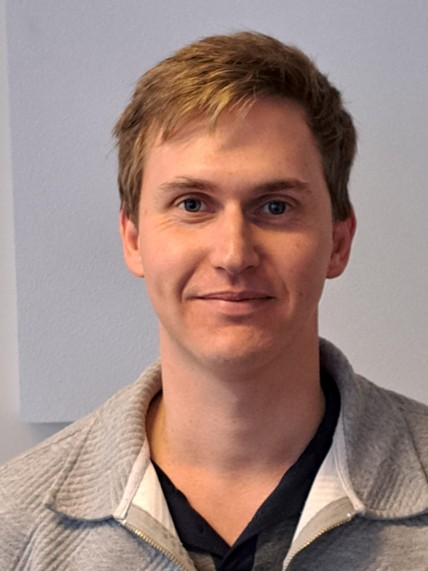

***

 

{#id .class width=90% height=90%}

I’m Joe, an interdisciplinary computational ecologist at the University of Cambridge (Leverhulme Early Career Fellow), with a broad interest in the causes and consequences of global biodiversity change (particularly pollinators and insects), loss-of-control risk for autonomous systems in conservation, unconventional monetary policy intervention for biodiversity change, combining distinct forms of foundational AI for the simulation of ecological interactions, problems that fall at the intersection of science and engineering, and metacognition in relation to communication, decision-making, and strategic leadership in research.

I'm a strong believer in the philosophies of [Quiet](https://en.wikipedia.org/wiki/Quiet:_The_Power_of_Introverts_in_a_World_That_Can%27t_Stop_Talking), [Pathological Altruism](https://en.wikipedia.org/wiki/Pathological_Altruism), [Thinking, Fast and Slow](https://en.wikipedia.org/wiki/Thinking,_Fast_and_Slow), and [Wikipedia](https://www.wikipedia.org/). If you ask me about speculative hard-science fiction I will probably try to lend you my copy of [Blindsight](https://en.wikipedia.org/wiki/Blindsight_(Watts_novel)).

Prior to Cambridge I worked at the Natural History Museum on the NERC Highlights grant GLiTRS (https://glitrs.ceh.ac.uk/), a consortium of brilliant entomologists and biodiversity scientists. On GLiTRS we compiled evidence on insect biodiversity and built statistical models to predict insect biodiversity change (see [Cooke & Outhwaite et al. 2025](https://doi.org/10.1126/science.adq2110)). Prior to GLiTRS I worked at the Leverhulme Centre for Demographic Science (University of Oxford) and Nuffield College on the ERC Advanced Grant CHRONO, researching the causes of changes in human sleep disruption, building models predicting social media activity during the COVID-19 pandemic, and contributing towards the government efforts of SAGE in anticipating the UK response to the reintroduction of behavioural interventions for COVID-19.

I completed my PhD jointly between UCL, the Institute of Zoology, and the RSPB (CASE partnership), supervised by [Dr Tim Newbold](https://timnewbold.github.io/), [Dr Robin Freeman](https://www.zsl.org/science/users/robin-freeman), and [Prof. Richard Gregory](https://profiles.ucl.ac.uk/60259-richard-gregory). My PhD research explored a broad spectrum of tools and questions in the context of pollinator biodiversity change, including the use of text-mining tools to quantify  biases and synthesise research data, the response of global pollinator biodiversity to land-use and climate change, and the potential of Wikipedia data for quantifying change in pollinator biodiversity awareness.

Prior to my PhD I worked at UNEP-WCMC converting VBA macros to R Shiny, and at the journal Scientific Reports on manuscript peer-review, decisions, the assessment of clinical trials, and the growth of the editorial board. I also worked at a cafe where they let me make scones. Once.

